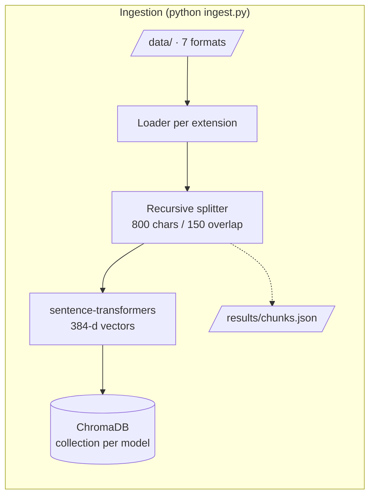
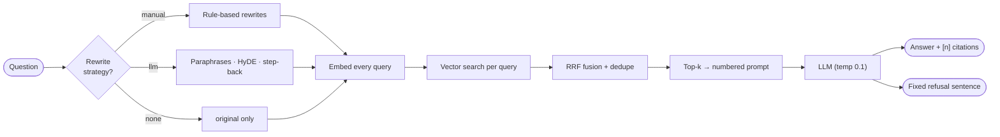
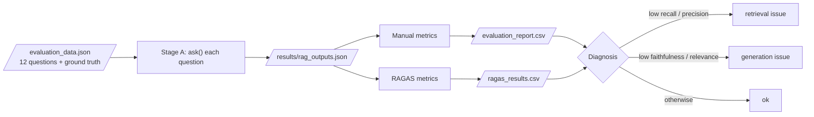
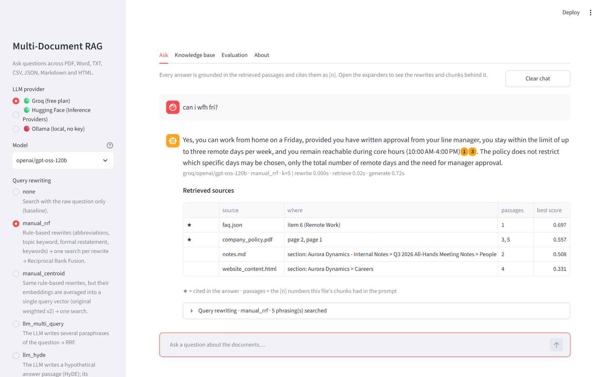
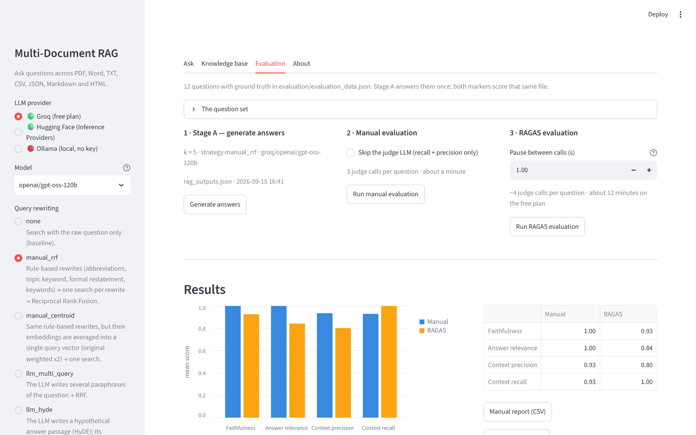

# Multi-Document RAG System with Vector Database and RAGAS Evaluation

A complete, measurable Retrieval-Augmented Generation (RAG) system that answers
questions from **seven document formats** (PDF, DOCX, TXT, CSV, JSON, Markdown,
HTML), shows **where every answer came from**, rewrites queries **manually (by
embeddings) and with an LLM**, and evaluates itself **manually and with RAGAS**
on Faithfulness, Answer Relevance, Context Precision and Context Recall.

It is a command-line application: an interactive question loop (`main.py`),
an ingestion script (`ingest.py`) and two evaluation scripts, all driving the
same pipeline.

```
Multiple documents -> load -> extract text -> chunk -> embed -> ChromaDB
User question -> (rewrite) -> embed -> similarity search -> top-k chunks
              -> prompt with numbered context -> LLM -> answer + [n] citations
Question + answer + contexts + ground truth -> manual evaluation -> RAGAS -> CSV reports
```







---

## 1. Features

| Area | What you get |
|---|---|
| Loaders | One loader per format, each returning text + citation metadata (page / row / section / item) |
| Chunking | From-scratch recursive character splitter with overlap and stable `chunk_id`s |
| Embeddings | Local `sentence-transformers` (4 selectable models, no API key) |
| Vector DB | Persistent **ChromaDB** collection per embedding model (cosine), behind an abstract `VectorStore` |
| Query rewriting | **Manual** (rule-based rewrites → embed each → RRF fusion, or embedding centroid) and **LLM** (multi-query, HyDE, step-back) and **hybrid** |
| LLM | **Groq** (free) or **Hugging Face Inference Providers** through one OpenAI-compatible client; live model list |
| Answers | Grounded prompt with numbered passages; `[n]` citations (model variants such as `【2】`, `【2†L1-L4】`, `[1, 3]`, `[2-4]` are normalised); explicit "I don't have enough information" refusal |
| CLI | Interactive loop with live switching of provider, model, strategy and top-k (`/provider`, `/model`, `/strategy`, `/k`); rewrite and chunk inspection; `--list-models`; `--evaluate` prints the four metrics under every answer |
| Web app | `streamlit run app.py` — the same pipeline behind a browser page: chat with citation chips, rewrites and chunks on demand, per-answer evaluation, document upload + re-index, and the two evaluation reports side by side |
| Inspection | `results/chunks.json` — every chunk exactly as embedded (id, source, locator, text); `results/ingest_manifest.json` — per-file counts and timings |
| Evaluation | Hand-written metrics **and** RAGAS on the same outputs, side-by-side comparison, retrieval-vs-generation diagnosis |

---

## 2. Project structure

```
multi_document_rag_project/
├── data/                        # YOUR documents go here (sub-folders allowed)
│   ├── company_policy.pdf       employee_handbook.docx   leave_policy.txt   hr_data.csv   <- sample set
│   ├── faq.json                 notes.md                 website_content.html             <- (replace freely)
├── loaders/                     # one loader per format -> list[LoadedDocument]
│   ├── base.py  pdf_loader.py  docx_loader.py  txt_loader.py  csv_loader.py
│   ├── json_loader.py  markdown_loader.py  html_loader.py
├── src/
│   ├── config.py                # every setting (.env + defaults)
│   ├── console.py               # framed / coloured console output for the CLIs
│   ├── frontend.py              # helpers shared by main.py and app.py (live evaluator, manifest checks)
│   ├── document_loader.py       # extension -> loader dispatch, load_directory()
│   ├── text_splitter.py         # recursive character splitter, Chunk + chunk_id
│   ├── embeddings.py            # EmbeddingModel, centroid(), cosine_similarity()
│   ├── vector_database.py       # VectorStore ABC + ChromaVectorStore + factory
│   ├── retriever.py             # top-k search, multi-query RRF fusion
│   ├── query_rewriter.py        # manual + LLM rewriting strategies
│   ├── prompt.py                # answering / rewriting / judging prompts
│   ├── llm.py                   # OpenAI-compatible client, Groq + HF presets
│   └── rag_pipeline.py          # RAGPipeline.ask() -> RAGResponse
├── evaluation/
│   ├── evaluation_data.json     # 12 questions with ground truth + expected sources
│   ├── evaluation_utils.py      # shared I/O, summary, diagnosis
│   ├── manual_evaluation.py     # the four metrics by hand -> results/evaluation_report.csv
│   └── ragas_evaluation.py      # the four metrics via RAGAS -> results/ragas_results.csv
├── results/
│   ├── chunks.json              # every chunk produced by ingest.py (inspect the split)
│   ├── ingest_manifest.json     # per-file parts / characters / chunks, model, timings
│   ├── rag_outputs.json         # Stage A of evaluation: answers + retrieved contexts
│   ├── evaluation_report.csv    # manual metrics per question
│   └── ragas_results.csv        # RAGAS metrics per question
├── docs/
│   ├── Multi_Document_RAG_Presentation.pptx        # slide deck (light theme)
│   ├── Multi_Document_RAG_Presentation_Dark.pptx   # same deck, dark theme
│   ├── Streamlit_UI_Presentation.pptx / _Dark.pptx  # the web-front-end homework deck
│   ├── screenshots/                                # app screenshots used in the docs
│   └── Multi_Document_RAG_Project_Report.docx      # project report
├── main.py                      # CLI (interactive loop / one-shot questions)
├── app.py                       # web app (Streamlit) on the same pipeline
├── ui/                          # web-app rendering helpers: components.py, styles.py
├── ingest.py                    # ingestion pipeline
├── requirements.txt  .env.example  .gitignore  README.md
└── chroma_db/                   # created at ingest time (git-ignored)
```

Every file starts with a docstring explaining *why* it exists and how it fits
the pipeline; non-obvious code is commented inline.

---

## 3. Setup

Tested on **Python 3.14** (Windows). Any Python ≥ 3.11 should work.

```bash
# 1. create and activate a virtual environment
python -m venv .venv
.venv\Scripts\activate            # Windows      (macOS/Linux: source .venv/bin/activate)

# 2. install dependencies (two steps, see note below)
pip install -r requirements.txt
pip install ragas==0.4.3 --no-deps

# 3. configure keys
copy .env.example .env             # then edit .env
```

> **Why two install steps?** `ragas` declares a dependency on `scikit-network`,
> which has no Python 3.14 wheel and fails to compile. It is only used by
> RAGAS's synthetic test-set generator, which this project does not use, so
> RAGAS is installed without dependencies and every dependency it *does* need
> is listed in `requirements.txt`. (`pip check` will mention scikit-network;
> that is expected.)

### API keys (`.env`)

| Variable | Needed for | Where to get it |
|---|---|---|
| `GROQ_API_KEY` | answers, LLM rewriting, RAGAS judge | <https://console.groq.com/keys> — **free plan, no credit card** |
| `HF_TOKEN` | same, via the Hugging Face router (optional second provider) | <https://huggingface.co/settings/tokens> |
| *(none)* — `OLLAMA_BASE_URL` | Ollama, a third provider that runs open models **on your own machine**: no key, no internet, no rate limits | install from <https://ollama.com/download>, then `ollama pull llama3.2` |

Nothing else needs a key: embeddings run locally and ChromaDB is embedded.
Keys can also be exported as environment variables for a single session.

> **About Groq pricing.** The per-token prices on <https://console.groq.com/docs/models>
> apply to the paid *Developer* plan. A new account is on the **Free Plan**
> (no charge) with per-model limits of roughly **30 requests/min, 1,000
> requests/day, 8K tokens/min, 200K tokens/day**. Free-plan chat models
> (Sept 2026): `openai/gpt-oss-120b` (default), `openai/gpt-oss-20b`,
> `qwen/qwen3.6-27b`, `qwen/qwen3.8-27b`. The Llama 3.x models are now
> Enterprise-only. These are "reasoning" models, so `src/llm.py` sends
> `reasoning_effort=low` / `include_reasoning=false` to keep replies short and
> inside the token budget. A full RAGAS run over the 12-question set takes a
> few minutes because of the 8K tokens/min cap.

---

## 4. Run it

### Your documents go in `data/`

`data/` is the knowledge base. Drop any mix of **PDF, DOCX, TXT, CSV, JSON,
Markdown and HTML** files there (sub-folders are fine), then run `python ingest.py`.
It ships with seven sample documents about a fictional company, *Aurora
Dynamics*, so everything works out of the box — delete or replace them with
your own files whenever you like. Two things to know:

* `ingest.py` **rebuilds** the index from whatever is in `data/` (use `--append`
  to add files without clearing). `main.py` warns you when `data/` has changed
  since the last ingestion.
* `evaluation/evaluation_data.json` was written for the sample documents. With
  your own files, write a matching question set and pass `--dataset` to the
  evaluation scripts (they refuse to score a mismatched set unless `--force`).

```bash
python ingest.py                         # load data/ -> chunk -> embed -> ChromaDB (writes results/chunks.json)
python main.py                           # interactive question loop
python main.py -q "How many annual leave days are allowed?"   # one-shot
python main.py --list-models             # models your provider offers
python main.py --evaluate                # + Evaluation: block under every answer
```

Example CLI session (the layout from the project brief, framed by `src/console.py`;
colour is used in a terminal, plain ASCII when piped or with `NO_COLOR=1` / `RAG_ASCII=1`; the frame
follows the terminal width up to 140 columns, or `RAG_WIDTH=<n>`):

```
┌─ groq/openai/gpt-oss-120b │ manual_rrf │ k=5 [eval]
│  /strategy /strategies /k /provider /providers /model /models /chunks /eval /help /bar /quit
└─❯ How many annual leave days are allowed?

┌─ Query rewriting  manual_rrf ───────────────────────────────────────────────────┐
│  • Detected topic(s): Annual Leave (keyword hits: 1)                            │
│                                                                                 │
│  original   How many annual leave days are allowed?                             │
│  rewrite 1  annual leave: How many annual leave days are allowed?               │
│  rewrite 2  What does the Annual Leave policy say about: How many annual ...    │
│  rewrite 3  annual leave days allowed                                           │
└─────────────────────────────────────────────────────────────────────────────────┘

┌─ Retrieved Sources  ★ = cited in the answer ────────────────────────────────────┐
│  1.   ★  employee_handbook.docx    section: Leave at a Glance      passages 2   │
│  2.   ★  leave_policy.txt          section: 2. ANNUAL LEAVE, ...   passages 3,4,5│
│  3.      faq.json                  item 2 (Leave)                  passages 1   │
└─────────────────────────────────────────────────────────────────────────────────┘

┌─ Answer ────────────────────────────────────────────────────────────────────────┐
│  Employees are entitled to 20 paid annual leave days per calendar year [2][3]. │
└─────────────────────────────────────────────────────────────────────────────────┘
  groq/openai/gpt-oss-120b  │  rewrite 0.002s  ·  retrieve 0.09s  ·  generate 0.63s

┌─ Evaluation  0 = worst, 1 = best ───────────────────────────────────────────────┐
│  Faithfulness        1.00        ████████████████████                           │
│  Context Precision   1.00        ████████████████████                           │
│  Answer Relevance    High (1.00) ████████████████████                           │
│  Context Recall      1.00        ████████████████████                           │
│                                                                                 │
│  Diagnosis           ok                                                         │
└─────────────────────────────────────────────────────────────────────────────────┘
```

Faithfulness and answer relevance are judged by the LLM for any question;
context precision and recall need a ground-truth answer, so they are computed
when the question is one of the 12 in `evaluation/evaluation_data.json` and
shown as `n/a` otherwise. The same functions produce the batch reports below.

Useful flags: `main.py --strategy llm_hyde`, `--k 8`, `--model openai/gpt-oss-20b`, `--provider huggingface --model Qwen/Qwen2.5-7B-Instruct`,
`--show-chunks` (print the retrieved chunk text), `--hide-rewrites`,
`ingest.py --chunk-size 500 --chunk-overlap 100 --embedding-model BAAI/bge-small-en-v1.5 --append`.

### Inspecting the chunks — `results/chunks.json`

`ingest.py` writes every chunk it produced — *before* embedding, so the file
exists even if the model download fails — in document order:

```json
{
  "generated_at": "2026-09-13T02:27:11+00:00",
  "chunk_size": 800, "chunk_overlap": 150, "total_chunks": 89,
  "chunks": [
    {
      "order": 40,
      "chunk_id": "hr-data__r8__c0",
      "source": "hr_data.csv", "file_type": "csv",
      "locator": "row 8", "chunk_index": 0, "characters": 206,
      "text": "employee_id: AD-008; name: Hassan Raza; department: Engineering; ...",
      "metadata": { "source": "hr_data.csv", "row": 8, "chunk_index": 0, "...": "..." }
    }
  ]
}
```

`chunk_id` is the same id stored in ChromaDB and shown by `--show-chunks`, so a
retrieved passage can be looked up here; neighbouring entries show the 150-character
overlap. Re-run `ingest.py` with different `--chunk-size` / `--chunk-overlap` and
compare the file to see the effect of the splitter settings.

Inside the interactive loop you can change settings without restarting:

| Command | Effect |
|---|---|
| `/strategy <name>` | switch rewriting strategy (`none`, `manual_rrf`, `manual_centroid`, `llm_multi_query`, `llm_hyde`, `llm_step_back`, `hybrid`) |
| `/strategies` | list the strategies with a one-line description (bare `/strategy` does the same) |
| `/k <n>` | number of chunks retrieved |
| `/provider <name>` | switch LLM provider (`groq`, `huggingface`, `ollama` — also accepts `hf`, `Hugging Face`) |
| `/providers` | list the providers and whether each is ready — key present, or for Ollama the local server answering (bare `/provider` does the same) |
| `/model <id>` · `/models` | switch model *within the current provider* · list its models (curated ones first, then the provider's live catalogue). An id that is not in the list is refused with a hint; typing a provider name here points you to `/provider` |
| `/chunks` | toggle printing of the retrieved chunk text (similarity, hit count, preview) |
| `/eval` | toggle the per-answer `Evaluation:` block (faithfulness, precision, relevance, recall) |
| `/help` · `/bar` | reprint this command list · hide/show the one-line command bar that sits under every prompt |
| `/quit` | exit |

---

### The web app — `streamlit run app.py`

The command-line app is the reference front-end; the web app is the same pipeline behind a
browser page, for demos and for people who would rather click than type commands.

```bash
streamlit run app.py
```



| Tab | What it does | Same code as |
|---|---|---|
| **Ask** | chat with the documents; answers carry `[n]` citation chips (hover → source and locator), a sources table with ★ for cited files, and expanders for the query rewrites and the retrieved chunks (score, similarity, hit count, per-phrasing rank, text); an optional per-answer **Evaluation** block | `RAGPipeline.ask()`, `AnswerEvaluator` |
| **Knowledge base** | what the index holds (from the manifest), the files in `data/`, drag-and-drop upload, a remove-files control (the index follows on the next rebuild), rebuild / append with chunk size and overlap, and a searchable chunk browser over `results/chunks.json` | `ingest()` |
| **Evaluation** | run Stage A, the manual evaluation and RAGAS from the browser with progress; mean scores as a grouped chart, per-question table with diagnosis and notes, CSV downloads | `run_pipeline_on_dataset()`, `manual_evaluation.evaluate_rows()`, `ragas_evaluation.evaluate_rows()` |

The sidebar mirrors the CLI's settings: provider (with a ready / not-ready light, Ollama included),
model (curated first, then the live list), rewriting strategy with descriptions, k, and the three
display toggles. The index summary and the "`.env` differs from the index" / "`data/` changed"
warnings are the same checks `main.py` prints at start-up.



How it is wired — nothing in `src/` or `evaluation/` changed to add the app:

* the helpers both front-ends need (`AnswerEvaluator`, ground-truth lookup, manifest checks,
  provider-name resolution) moved from `main.py` into `src/frontend.py`; the CLI imports them;
* `ui/components.py` renders a `RAGResponse` the way `src/console.py` prints it;
* the embedding model, vector store and judge are created once per server process with
  `st.cache_resource` and shared by every browser tab; switching provider or model only rebuilds
  the LLM client through `pipeline.set_llm()`; an ingest clears the caches so counts and manifest
  refresh;
* long runs (Stage A, RAGAS) show progress through `st.status` and the same `progress` callback the
  scripts use — leave the tab open while they run.

Both front-ends can be open at the same time; the self-healing ChromaDB handle covers one of them
rebuilding the index while the other is answering.

## 5. Query rewriting

Users type short, informal questions; documents are formal. Rewriting closes
that gap. All strategies are selectable with `--strategy` (or `/strategy` in
the loop), and the CLI prints every rewrite; `--show-chunks` shows which chunks
they surfaced and how many rewrites agreed on each.

### 5.1 Manual rewriting "by generating embeddings" (no LLM)

`src/query_rewriter.py::ManualRewriter` produces rule-based variations:

| # | Rewrite | Example for `can i wfh fri?` |
|---|---|---|
| 0 | original (always kept) | `can i wfh fri?` |
| 1 | abbreviations expanded | `can i work from home friday?` |
| 2 | keyword-anchored (detected topic's canonical phrase prefixed) | `remote work: can i work from home friday?` |
| 3 | formal restatement | `What does the Remote Work policy say about: can i work from home friday?` |
| 4 | keyword-only (stop-words removed) | `work home friday` |

Each variation is then **embedded separately** with the same model as the
documents and used in one of two ways:

* **`manual_rrf`** — one similarity search per variation; the ranked lists
  are merged with **Reciprocal Rank Fusion**
  `score(chunk) = Σ 1 / (60 + rank_in_list)`. Chunks found by several
  variations rise to the top; duplicates are detected by `chunk_id`, and the
  hit count is shown in the CLI's chunk view (`hits=4`).
* **`manual_centroid`** — the variation embeddings are **averaged** into one
  vector (original weighted ×2, then re-normalised) and searched once. This
  blends the phrasings into a query that sits "between" them.

Rules (inherited from the earlier query-rewriting exercise): never answer
during rewriting, never drop the original, never add facts.

### 5.2 LLM rewriting

* **`llm_multi_query`** — the model writes 3 paraphrases → RRF with the original.
* **`llm_hyde`** — the model writes a *hypothetical answer passage* in policy-document
  style; its embedding is searched alongside the question (HyDE).
* **`llm_step_back`** — the model writes a broader question to pull in background context.
* **`hybrid`** — manual rewrites + LLM paraphrases, all fused with RRF.

If the LLM call fails (no key, rate limit), the pipeline falls back to the
manual rewriter and says so in the rewrite panel.

---

## 6. Evaluation

```bash
python evaluation/manual_evaluation.py --generate   # Stage A (answers) + manual scoring
python evaluation/ragas_evaluation.py               # RAGAS scoring of the SAME outputs
```

**Stage A** runs every question in `evaluation/evaluation_data.json` through the
pipeline and stores `{question, answer, contexts, ground_truth, sources}` in
`results/rag_outputs.json`. **Stage B** scores that file — both evaluators judge
exactly the same answers, so their numbers are comparable.

| Metric | Question it answers | Manual implementation | RAGAS |
|---|---|---|---|
| Faithfulness | Is every claim in the answer supported by the retrieved context? | LLM extracts claims → verifies each → supported/total | `Faithfulness` |
| Answer relevance | Does the answer address the question? | LLM rates 1–5 (scaled 0–1) + question/answer cosine | `AnswerRelevancy` |
| Context precision | Are the relevant chunks ranked first? | chunk relevant if cosine(chunk, ground truth) ≥ 0.45; average-precision formula | `ContextPrecisionWithReference` |
| Context recall | Was the evidence for the ground truth retrieved? | fraction of ground-truth content words/numbers present in contexts (+ expected-file hit rate) | `ContextRecall` |

The `diagnosis` column turns the numbers into a verdict:

* low **context recall** → **retrieval issue** (evidence never retrieved) → change strategy / k / chunking / embedding model
* low **faithfulness** or **answer relevance** → **generation issue** → prompt / temperature / model
* low **context precision** only → **retrieval noise** → lower k, better rewriting

The dataset contains multi-document questions, a structured-data question
(CSV row), an aggregate question (department head-count from the CSV summary
document) and one **out-of-scope** question ("stock price") that must be
refused — a direct test of hallucination resistance.

### Sample results (k = 5, strategy `manual_rrf`, judge `openai/gpt-oss-120b`)

| Metric | Manual | RAGAS |
|---|---|---|
| Faithfulness | 1.00 | 0.93 |
| Answer relevance | 1.00 | 0.84 |
| Context precision | 0.93 | 0.80 |
| Context recall | 0.93 | 1.00 |

Two rows are worth reading closely, because they show *why* you evaluate twice:

* **Q12 (out-of-scope, "stock price")** — the system correctly refuses. The manual
  metric scores that refusal as fully relevant (1.00); RAGAS's `AnswerRelevancy`
  gives **0.00 by design** (it treats non-committal answers as irrelevant). Same
  answer, opposite verdicts — know what your metric rewards.
* **Q6 (CSV row lookup)** — the answer *"Fatima Noor's manager is Hira Siddiqui,
  and her role is Senior Data Engineer"* is exactly what the HR row says, yet
  RAGAS faithfulness came back 0.50: the judge model split it into two claims and
  rejected one. LLM judges are noisy; a second opinion (the manual metric gave
  1.00) is how you catch that.
* **Q11 (aggregate)** — manual context recall 0.43 flags a *retrieval issue*: the
  count (4) came from the CSV summary chunk, but not all four employee rows named
  in the ground truth were retrieved. Raising k or adding a "department" rewrite
  would fix it.

RAGAS uses Groq as a free judge (`llm_factory` accepts any OpenAI-compatible
client) and the local sentence-transformers model for embeddings. The scripts
call metrics sequentially with a small pause to respect free-tier rate limits;
a metric that fails is recorded as blank with the error in `ragas_errors`.

---

## 7. Options and how to extend

* **LLM models** — `python main.py --list-models` (or `/models` in the CLI) prints the provider's
  live model catalogue: a curated handful first (Groq's free-plan models; a few well-known
  Hugging Face models), then everything else the API reports (audio/moderation/guard models
  filtered out; the Hugging Face router lists 140+ chat models). `/model <id>` accepts any id
  from that list; `--model <id>` on the command line accepts anything. Defaults come from
  `GROQ_MODEL` / `HF_MODEL`. Note the difference between the two commands: `/provider huggingface`
  switches provider, `/model <id>` switches model *within* the current provider.
* **Two front-ends, one pipeline** — `main.py` (CLI) and `app.py` (Streamlit) both call
  `RAGPipeline.ask()`; a new setting belongs in `src/config.py`, then one widget in the sidebar and
  one flag/command in the CLI. `streamlit` is only needed for the web app.
* **Three providers, one client** — Groq (free plan, default), Hugging Face (router,
  140+ models) and Ollama (local; the banner shows *ready* when its server answers,
  otherwise *not running* with the command to start it). **Add another** by adding one
  `ProviderSpec` to `PROVIDERS` in `src/llm.py` — OpenAI, Gemini's OpenAI-compatible
  endpoint, Together… all work; the docstring there shows the OpenAI entry.
* **Embedding models** — `EMBEDDING_MODELS` in `src/config.py`; each gets its own
  ChromaDB collection so dimensions never mix.
* **Add a vector database** — subclass `VectorStore` in `src/vector_database.py`
  (five methods) and register it in `VECTOR_STORES`.
* **Add a file format** — write `loaders/xxx_loader.py` returning
  `list[LoadedDocument]`, register the extension in `src/document_loader.py`
  and `SUPPORTED_EXTENSIONS`.
* **New topics** — extend `TOPIC_KEYWORDS` / `ABBREVIATIONS` in `src/config.py`
  so the manual rewriter recognises them.

---

## 8. Troubleshooting

| Symptom | Fix |
|---|---|
| `UnicodeEncodeError` in the console | already handled: the CLIs switch stdout to UTF-8; if it still happens set `PYTHONIOENCODING=utf-8` |
| `No API key for Groq` | put `GROQ_API_KEY=...` in `.env` (or export it as an environment variable) |
| `The vector store is empty` / `data/ is empty` | put documents in `data/` and run `python ingest.py` |
| First run is slow | the embedding model (~90 MB) is downloaded once and cached by Hugging Face |
| HTTP 429 / rate limited | free-plan limit (8K tokens/min); the client waits and retries; raise `ragas_evaluation.py --sleep`, lower k, or switch to `openai/gpt-oss-20b` |
| RAGAS metric blank | see `ragas_errors` in the CSV — usually a rate limit or the judge returned malformed JSON; re-run or use the 120B judge |
| Changed embedding model, no results | each model has its own collection — ingest again with that model selected |
| `data/ changed since the index was built` | files were added/removed/edited after ingestion — run `python ingest.py` |
| `pip check` complains about scikit-network | expected (see Setup) |
| `/models` shows only five models | it lists the *current* provider; run `/provider huggingface` first (the Hugging Face router lists 140+ chat models) |
| `ollama … not running` / `Connection error` | Ollama is not installed or not started: install it, run `ollama serve` (the desktop app does this) and `ollama pull llama3.2`; `/models` then lists what is installed |
| `'X' is not in the model list for groq` | pick an id from `/models`; Groq's Llama 3.x models are Enterprise-only and are filtered out |
| a model, rate limit or outage error mid-session | printed as one red line; the session continues — switch with `/provider` / `/model` or wait |
| web app shows old counts after an ingest from the CLI | the pipeline is cached per server process — click **Ingest now** in the app (which clears the caches) or restart `streamlit run app.py` |
| `AttributeError: module 'ui.components' has no attribute …` while developing | Streamlit hot-reloads `app.py` but not imported modules — restart the server after editing `ui/` or `src/` |
| frames look too narrow / too wide | the frame follows the terminal (re-measured whenever a section opens, cap 140); `RAG_WIDTH=<n>` forces a width, `NO_COLOR=1` / `RAG_ASCII=1` strip colour / box characters |

---

## 9. Learning flow

Loading → Chunking → Embeddings → Vector Database → Retrieval → Generation → Evaluation.
Read the modules in that order; each docstring explains its stage.
